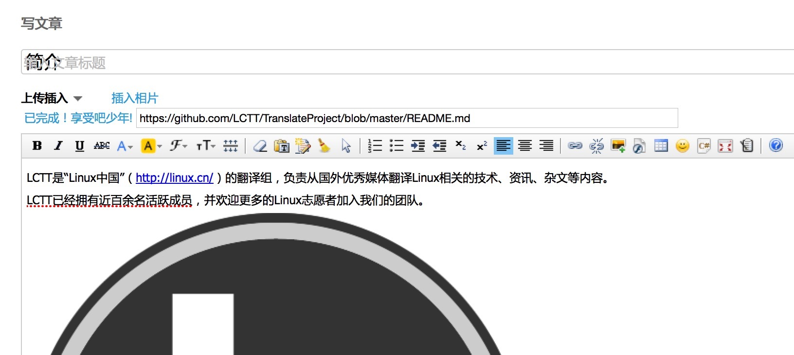

Github同步插件
===

###首先看看效果，图片展示:


代码测试:

```
#include <stdio.h>
int main() {
    printf("Andy is single.\n");
    return 0;
}
```

引用测试:

> Andy needs a girl friend.

好了。以上是用来测试的。转入正文。这个插件的使用方法很简单。面向的受众也会很窄。因为主要是为了自己的使用方便。我的习惯是将博客写成markdown,然后提交到github上去，做一个备份。然后再在blog上填写。之前写了markdown的几个插件，在没有贴图的时候还是比较方便的，但是如果图片比较多的话，就变得非常的痛苦。比如，我在markdown里面写的是**(./images/github-test-1.jpg)**,但是博客里无法识别，所以需要先把图片上传到EM相册里面，然后再一个一个的修改链接，痛苦。后来觉得可以用github的图片，但是细想，那还不如直接用它的markdown解析效果。所以，就写了这么个插件。

###使用方法如下：

安装插件之后，你会在博客后台，写日志的时候看到如下的东西：

> 

填写完成之后，只需点击前面的说明，就可以同步了。效果如下：

> 

然后就是简单的保存和提交了。还在怀疑吗，其实这篇文章就是用这个插件写出来的,原文在[这-GITHUB](https://github.com/MikeCoder/MyStudy/blob/master/MyBlogs/Github%E5%90%8C%E6%AD%A5%E6%8F%92%E4%BB%B6.md)。

#注意事项!!!
写markdown的时候需要注意以下几点。开头第一行一定需要是标题，且用"==="或者"---"标注

比如：

```
这是标题
===

这边是正文。。。。。
。。。。。。。。。。
```

这样插件才能进行识别(识别的是H2标签的标题，了解的可以使用其他的方式)。

###实现思路：

简单而又麻烦的字符串操作。Ajax。恩，就是这么简单。。。
