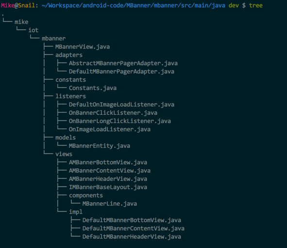

MBanner2 项目(一) --- 基本设计
---

写这篇文章的一个出发点就是，对自己的 [第一版本](./MBanner介绍.md) 非常的不满意，很多地方的解决思路不够优雅。换句话说就是基于 lib 的二次自定义非常麻烦。

所以才会开启 2.0 版本的开发(反正用的人也不会多，但是我比较喜欢抠细节)。

自定义程度不高主要体现在三方面：

1. PagerViewAdapter 实现方式为 class，并不是接口，导致无法自定义 Adapter，从而绝了换 view 的路。
2. PageIndicator 实现方式单一，且无法改变。
3. 代码的可测试性不强。(在安卓的组件中，这个问题还是挺棘手的)

总的来说，这只是个为了项目而催生的一个紧急替代品，并不能算得上是一个比较靠谱的开源库。所以 MBanner2 应运而生。 也算了了我一个心愿。

其实，这个空间也可以作为一个 ImageView 来使用。因为从逻辑和功能上说，这两个是非常相似的。所以这也是我安卓控件模块化的一个开始。

也参考了几个开源的高 star 项目，比如：

+ [saiwu-bigkoo/Android-ConvenientBanner](https://github.com/saiwu-bigkoo/Android-ConvenientBanner)
+ [JeasonWong/QingtingBannerView](https://github.com/JeasonWong/QingtingBannerView)
+ [youth5201314/banner](https://github.com/youth5201314/banner)

收获的话，大概如下：

1. 之前，我都是直接绑定第三方图片加载库来进行图片加载的，但是在阅读代码的时候，看到了 youth5201314 的一个巧妙的实现思路，即提供一个暴露给用户的 onImgLoadListener 接口，由用户来决定图片加载的逻辑。同时也可以提供一个默认的加载逻辑。
2. 在 saiwu-bigkoo 的实现方式，则是通过 ImageHolder 的思路来实现，以我个人而言，更倾向于 youth5201314 的实现思路。
3. 在样式自定义上，提供比较多样式的 youth5201314 的做法是提供茫茫多的 switch case 选项，这我觉得并不是一个很好的解决办法，只能说的上是一个临时解决方案。可扩展性并不高(因为总不可能在项目里，extends 它的类，然后在添 switch 吧)。
4. 在 saiwu-bigkoo 中，则提供了一个暴露的接口，用来设置 PageIndicator 的样式。但是也有一个局限性，就是这个只支持固定位置的 PageIndicator，所以在和 JeasonWong 的绘图实现是冲突的，并不能很好的集成。

所以这边的一个设计思路如下：

1. 将 Banner 的页面定义成三个部分
    + Banner Header 头部，即页面的上部显示，微信的做法是这边显示是时间(主要用于图片浏览的时候)
    + Banner Content  图片本体，即图片,可以理解为中间的翻页本体
    + Banner Bottom   底部，这部分可以实现为图片的标题，或者像微信一样附加了评论等按钮(朋友圈图片浏览)
2. 布局是这样设定的:

            <?xml version="1.0" encoding="utf-8"?>
            <RelativeLayout xmlns:android="http://schemas.android.com/apk/res/android"
                            android:layout_width="match_parent"
                            android:layout_height="match_parent"
                            android:orientation="vertical">
                <FrameLayout
                    android:id="@+id/layout_banner_header"
                    android:layout_width="match_parent"
                    android:layout_height="wrap_content"
                    android:layout_alignParentTop="true">
                </FrameLayout>
                <android.support.v4.view.ViewPager
                    android:id="@+id/layout_banner_content"
                    android:layout_width="match_parent"
                    android:layout_height="match_parent"
                    android:layout_above="@+id/layout_banner_bottom"
                    android:layout_below="@+id/layout_banner_header"
                    android:layout_gravity="center">
                </android.support.v4.view.ViewPager>
                <FrameLayout
                    android:id="@+id/layout_banner_bottom"
                    android:layout_width="match_parent"
                    android:layout_height="wrap_content"
                    android:layout_alignParentBottom="true">
                </FrameLayout>
            </RelativeLayout>

    + 最外面是用 RelativeLayout 进行布局，方便适应屏幕。
    + 上下抽象为 RelativeLayout，方便进行覆盖控件编码。
    + 中间则是 ViewPager，负责主内容的展示。
3. 接下来就是问题了，在一个 Banner 中，我们会提供一个 View 来作为单个 Banner 的内容展示。那么在这个抽象模型中，是放在什么位置？放在 ViewPager 里？还是 FrameLayout 里？前者好说，很好实现，但是，仿佛下面的那个 FrameLayout 没用了。如果放在下面的 FrameLayout 里面，那么，如何将 ViewPager 的滑动事件触发到 FrameLayout 中。
    + 这边就是用了一个比较笨的方法，可以理解为一个简单观察者模式。
    + 对于抽象成 FrameLayout 来说，他所展现的内容我们是动态添加进代码的。所以，对于添加进入 FrameLayout 的 View 来说，我们可以添加三个方法，即：
        + public abstract void setIndex(int idx, int total);
        + public abstract void setEntity(ArrayList<MBannerEntity> entities, int position); // 为什么使用 List 而不是单个的对象，为什么不是 List 而是 ArrayList？稍后解答
        + public abstract void setPageScroll(int idx, float offset);
    + 所以，可以在 MBannerView 中添加 listener，并将这三个方法进行调用。具体如下：

            private void generateBanner() {
                if (headerView == null) {
                    headerView = new DefaultMBannerHeaderView(getContext());
                    headerView.setEntity(entities, 0);
                    header.addView(headerView);
                }
                if (bottomView == null) {
                    bottomView = new DefaultMBannerBottomView(getContext());
                    bottomView.setEntity(entities, 0);
                    bottom.addView(bottomView);
                }
                if (pagerAdapter == null) {
                    pagerAdapter = new DefaultMBannerPagerAdapter(this);
                    content.setAdapter(pagerAdapter);
                }
                content.addOnPageChangeListener(new ViewPager.OnPageChangeListener() {
                    @Override
                    public void onPageScrolled(int position, float positionOffset, int positionOffsetPixels) {
                        Log.i(Constants.TAG, "onPageScrolled:" + positionOffset + ":" + positionOffsetPixels);
                        setPageScroll(position, positionOffset);
                        content.setCurrentItem(position, true);
                    }
                    @Override
                    public void onPageSelected(int position) {
                        Log.i(Constants.TAG, "onPageSelected:" + String.valueOf(position));
                        setIndex(position, entities.size());
                    }
                    @Override
                    public void onPageScrollStateChanged(int state) {
                        Log.i(Constants.TAG, "onPageScrollStateChanged:" + String.valueOf(state));
                    }
                });
            }
            public void setIndex(int current, int total) {
                if (headerView != null) headerView.setIndex(current, total);
                if (bottomView != null) bottomView.setIndex(current, total);
            }
            public void setPageScroll(int idx, float offset) {
                if (headerView != null) headerView.setPageScroll(idx, offset);
                if (bottomView != null) bottomView.setPageScroll(idx, offset);
            }

    + 这样，ViewPager 的变化可以反映到上下两个 FrameLayout 中，这就可以实现对应的控件变化。
    + 为什么使用 List 而不是单个对象：因为，在 FrameLayout 的 View 中，我们可能会需要知道总得数量，或者进行下一页的预览，使用 list 加 position 的组合会比较方便实现。
    + 为什么使用 ArrayList 而不是 List 接口：因为很多情况下，我们会通过 java 的序列化来进行数据的存储，而单独的 List 接口并没 implements Serializer 接口，导致无法序列化的异常。
4. 至此，基本的设计说完，接下来说的是图片加载。
    + 因为很多时候，项目中已经使用了对应的图片加载框架，比如说 Glide，ImageLoader 等等，我们不太可能会因为使用一个库而单独去构建一个新的图片加载库。所以这边我借鉴了 youth5201314 的实现思路。
    + 通过添加 ImageLoadListener 接口实现。 在代码中：

            @Override
            public void setEntity(ArrayList<MBannerEntity> entities, int position) {
                MBannerEntity entity = entities.get(position);
                if (onImageLoadListener == null) {
                    this.onImageLoadListener = new DefaultOnImageLoadListener();
                }
                this.onImageLoadListener.onImageLoad(mImageView, entity.getImgURL());
                titleTV.setText(entity.getTitle());
            }

5. 将默认形态的 ImageView 改成了 PhotoView，这样的一个好处就是可以实现多图片滑动的图片浏览器功能。而且仅需要改动极少量代码的情况下。
6. 最后附一张，项目结构图：
> 

以上，就是这次重构的大部分内容。接下来的一篇就是具体的如何编写可测试的代码，以及几个样例的使用示范。
