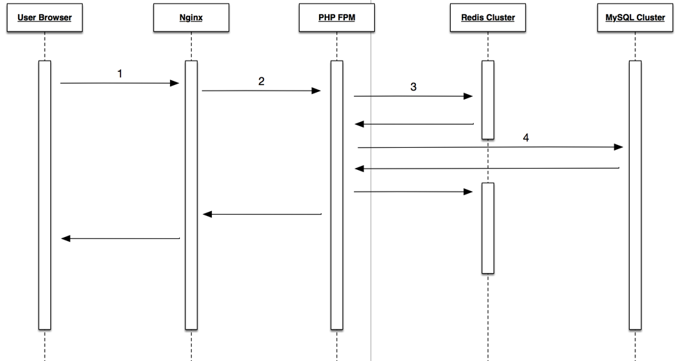

从一个问题开始谈秒杀业务场景
---

这个首先就是从一个知乎提问开始的。有一天我看到[这么一个提问](https://www.zhihu.com/question/46927678/answer/103463441)：
> 

然后，排名第一的答案就是一个静态页面，一个告知用户当前访问人数过多，请稍后再试。当然，这在很多人看来都是一个笑话。不过，对于一个之前做过秒杀业务的人来说。这真的是一段非常精妙的代码，某种角度上来说，这可以解决90%的秒杀场景。不过，用户体验太差，尤其是那些看到 console 有信息就会高潮的人来说。

所以，这边就先抛砖，来讲下我对秒杀业务的理解。

对于秒杀来说，它和传统的商城系统有着本质的区别：

1. 低廉价格
2. 大幅推广
3. 瞬时售空
4. 一般是定时上架
5. 流量时间短、瞬时并发量高

对于技术人员来说，我们其实常常会把注意力着重的放在第五点上，就是对于流量的处理。

其实，在我的观点里，初期就将全部的精力放在第五点的优化上，这并不是一个最优的解决方案。举个例子，12306售票系统。在第一版的时候，所有的火车票在同一时间点发售，导致服务器不堪重负，常常崩溃。虽然后来进行了紧急的优化，但是始终无法提供一个稳定的服务。但是，后来他采取了一个很巧妙的方法，将流量平分到一天的不同时间节点上，就是，不同票，不同发票时间。

当然，并不是说第五点的优化不重要。而是，既然可以通过业务上的手段，进行削峰操作，何乐而不为。

如果，对于不同的时间点，流量还是很大，那该如何。就如我的前东家。即使是每小时一次的秒杀，流量都极大。所以，这里就有很多的方法进行处理了。

这里就拿我的前东家的技术架构举例。

对于一个 request 请求来说，基本上是这样的一个流程：

> 
