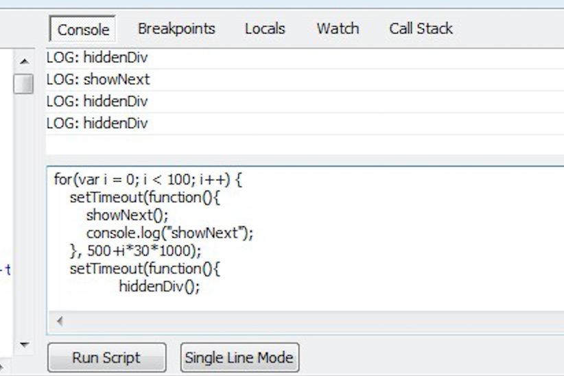

 江苏驾校上课脚本
 ====

被人误导了，使用了按键精灵，结果浪费了点时间。而且好久不用 windows，对于 ie9 的调试已经无话可说，和火狐的差距不是一点两点。

代码先说:
```
function next () {
    console.log("next function")
    if (13 - new Date().getHours() > 0) { // 13表示需要学习到下午一点，如果是晚上九点，就改成21
        showNext();
        setTimeout(function(){
            hiddenDiv();
            console.log("hiddenDiv");
        }, 5000);
        console.log("show next video");
    }
    setTimeout(function() {
        console.log("not play")
        next();
    }, 30000) // 30秒后再来一次
}
next();
```

以上就是代码，在 ie 的开发者工具栏里就可运行即可。

//====================================

以下是具体思路：

根据不可靠的坊间传闻，可以使用按键精灵模拟鼠标操作。于是试了下，自己写了几个脚本，发现，那个下一页按钮的位置不一定存在。貌似可以使用截取图片的方式来定位，不过后来，还是放弃了。

然后就是 js 了。首先就是通过获取元素然后执行 click() 方法,但是，查看之后，发现这段代码无法执行。或者说无法找到元素，发现确实，那部分的代码都是动态生成的。于是开始仔细阅读它的代码

> 

不难发现，其实他执行的是**shownext()**方法，所以我们直接在终端中执行，发现就可以跳到下一页。

然后如果我们不能进行跳转，就会出现一个弹出框。所以这边我们再看他的代码:

> 

可以发现，我们可以执行**hiddendiv()**方法使之消失

于是，代码就出来了。不断地调用自身，通过延时的方法避免了浏览器假死。

最后贴一张运行图:

> 

不得不说，ie9 的调试终端和火狐相比，简直差的太远了！
