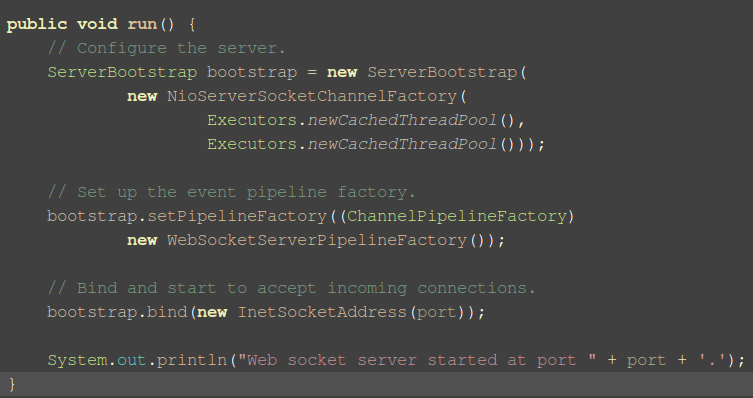
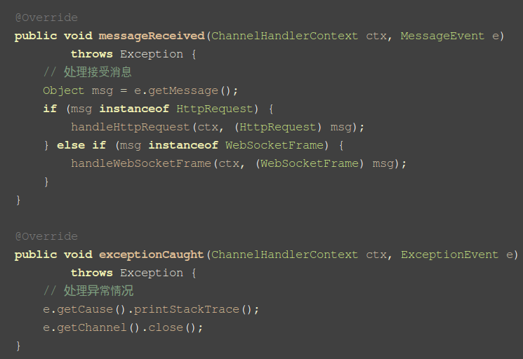
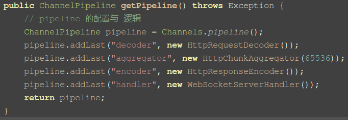
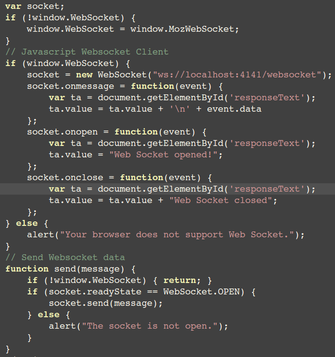

基于Netty实现WebSocket
---
####Netty的作用
1. Netty在这边的作用是做一个中间件，主要负责的是消息的接受，还有消息的处理，通过NIO的方式。
2. 因为Netty易于开发，性能，稳定性和灵活性，不妥协的方式来实现。

####文件结构
+ |-- WebSocketServer.java
+ |--WebSocketServerHandler.java 
+ |-- WebSocketServerPipelineFactory.java
+ |-- websocket.html

####具体解说
1. [WebSocketServer.java](https://github.com/MikeCoder/MyStudy/blob/master/%E6%88%91%E7%9A%84%E9%98%85%E8%AF%BB%E5%88%97%E8%A1%A8/Netty%E5%AD%A6%E4%B9%A0%28Mike%20Tang%29/%E5%9F%BA%E4%BA%8ENetty%E5%AE%9E%E7%8E%B0WebSocket/websocket/src/main/java/iot/mike/websocket/WebSocketServer.java)

>+ 这个类的主要作用是进行服务器的一些部署，还有进行bootstrap，这主要是在进行启动配置
>+ 
>+ 在这边我们可以看到，我们将WebSocketServerPipelineFactory注册进入了Netty,即将Netty的默认处理逻辑设置为我们需要的Factory.

2. [WebSocketServerHandler.java](https://github.com/MikeCoder/MyStudy/blob/master/%E6%88%91%E7%9A%84%E9%98%85%E8%AF%BB%E5%88%97%E8%A1%A8/Netty%E5%AD%A6%E4%B9%A0%28Mike%20Tang%29/%E5%9F%BA%E4%BA%8ENetty%E5%AE%9E%E7%8E%B0WebSocket/websocket/src/main/java/iot/mike/websocket/WebSocketServerHandler.java)
>+ 这个类主要是封装了我们的处理逻辑。
>+ 
>+ 由于Netty封装了所有接受的消息，所以在书写处理逻辑的时候，我们只需要覆盖两个父类的方法就行。

3. [WebSocketServerPipelineFactory.java](https://github.com/MikeCoder/MyStudy/blob/master/%E6%88%91%E7%9A%84%E9%98%85%E8%AF%BB%E5%88%97%E8%A1%A8/Netty%E5%AD%A6%E4%B9%A0%28Mike%20Tang%29/%E5%9F%BA%E4%BA%8ENetty%E5%AE%9E%E7%8E%B0WebSocket/websocket/src/main/java/iot/mike/websocket/WebSocketServerPipelineFactory.java)
>+ 这是这三个类当中代码最少的类了，主要的作用就是配置pipeline.
>+ 
>+ 我们可以看到最后的那个addLast，就是在给这个工厂类添加处理逻辑

4. [websocket.html](https://github.com/MikeCoder/MyStudy/blob/master/%E6%88%91%E7%9A%84%E9%98%85%E8%AF%BB%E5%88%97%E8%A1%A8/Netty%E5%AD%A6%E4%B9%A0%28Mike%20Tang%29/%E5%9F%BA%E4%BA%8ENetty%E5%AE%9E%E7%8E%B0WebSocket/websocket/src/main/java/iot/mike/websocket/html/websocket.html)
>+ 这段代码就是一个JS的WebSocket的调用，非常基础的一个。
>+ 
>+ 代码看看就知道了，不扯了。

####体会
1. 对于我的感觉，像这样的一个简单的WebSocket的程序，在Netty中部署了三个类。
2. 但是，这三个类的分工很明确，基本上可以将业务逻辑，事件注册，开启服务区分开来，并且整个框架是基于Message的，也就是可以很好的解耦合。
3. 另外，WebSocket，我觉得是今后的一个趋势，不管服务器使用那一种语言，必定需要面对十万上百万的Socket连接，传统的基于流的Socket形式必定会造成大量的性能浪费。
4. 同时，考虑到苏州的那个可能的电梯项目，7.5万条长连接可能基于原来的方式将会使用多台服务器，而采用这个Netty的现有框架，可以很快的进行开发，而且在效率和性能上也会有很大的提升。
5. 